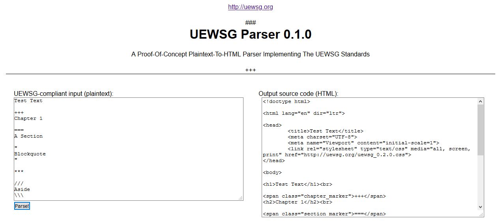

One of my recent projects was a parser for the UEWSG (Uniform English Writing Style Guide): it takes plaintext and turns it into compliant HTML5, with support for half of the block constrcuts as of version 0.1.0 .

